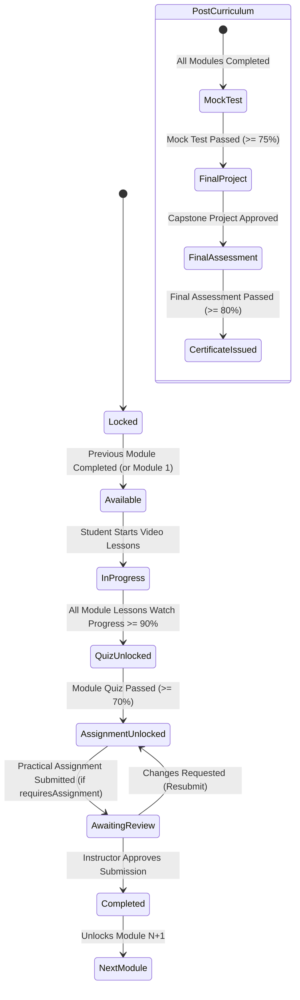

# Online Creative & IT Academy — Enterprise LMS Monorepo

A production-quality Learning Management System (LMS) web application featuring a **three-layer architecture**, **dual delivery modes (RECORDED self-paced & LIVE scheduled batches)**, **server-enforced progression state machine**, video watch tracking ($\ge 90\%$), automated MCQ assessments, instructor-reviewed practical assignments with per-module toggles, timed mock exams, capstone projects, final certification assessments, and **cryptographically verifiable PDF certificates with anti-tamper QR verification**.

---

## 🏛️ Architecture & Three-Layer Structure

Built as an **npm workspaces monorepo** (`apps/web`, `apps/api`, `packages/shared`):

```text
LMS/
├── apps/
│   ├── api/                          # Express + TypeScript + Prisma ORM + PostgreSQL API
│   │   ├── prisma/
│   │   │   ├── schema.prisma         # 35+ relational domain models, delivery modes, batches & indexes
│   │   │   └── seed.ts               # Database seed script (Recorded + Live batches, 20-MCQ quiz, enrollments)
│   │   ├── src/
│   │   │   ├── config/env.ts         # Environment loader & configuration
│   │   │   ├── lib/                  # Prisma singleton, Pino logger, standard errors, utils
│   │   │   ├── middleware/           # JWT auth, RBAC, Zod validation, rate limiting, error handling
│   │   │   ├── services/
│   │   │   │   ├── progression.service.ts   # Core pure state machine & server-side guards
│   │   │   │   ├── admin-student.service.ts # R7 student filtering by batch, section, schedule & level
│   │   │   │   ├── certificate.service.ts   # PDF generator (pdf-lib) & QR code engine
│   │   │   │   ├── payment/                 # Pluggable PaymentProvider (Mock + Razorpay stub)
│   │   │   │   ├── storage/                 # Pluggable StorageDriver (Local Disk + S3 stub)
│   │   │   │   ├── course.service.ts
│   │   │   │   ├── quiz.service.ts
│   │   │   │   ├── assignment.service.ts
│   │   │   │   ├── review.service.ts        # Instructor evaluation queue
│   │   │   │   ├── mock-test.service.ts
│   │   │   │   ├── final-project.service.ts
│   │   │   │   ├── final-assessment.service.ts
│   │   │   │   ├── report.service.ts
│   │   │   │   └── user.service.ts
│   │   │   ├── controllers/                 # REST controllers with error delegation
│   │   │   ├── routes/
│   │   │   │   ├── public.routes.ts         # Layer 1: Marketing, catalog, auth, inquiries & verification
│   │   │   │   ├── student.routes.ts        # Layer 2: Student portal, progress tracking, runner & submissions
│   │   │   │   ├── admin.routes.ts          # Layer 3: Staff admin portal, batch management, reviews, students
│   │   │   │   └── index.ts                 # Health endpoint (GET /api/v1/health) & route assembly
│   │   │   └── docs/swagger.ts              # OpenAPI Swagger specs (/api/docs)
│   │   └── tests/
│   │       ├── progression.service.test.ts  # Pure state machine unit tests (14/20 pass, 13/20 fail, toggles)
│   │       ├── certificate.service.test.ts  # PDF generation & QR embedding unit tests
│   │       └── progression.integration.test.ts # End-to-end learning flow integration tests
│   └── web/                          # Next.js 15 (App Router) + Tailwind CSS + Lucide Icons
│       └── src/
│           ├── app/
│           │   ├── page.tsx                 # L1 Marketing Landing Page & Curriculum Showcase
│           │   ├── courses/                 # L1 Public Course Catalog & [slug] syllabus details
│           │   ├── checkout/[courseId]/     # L1 Admission checkout & payment simulation
│           │   ├── verify/[certificateId]/  # L1 Public anti-tamper certificate verification
│           │   ├── login/ & register/       # L1 Auth forms + 1-Click Fast Demo Launchers
│           │   ├── student/                 # L2 Student Portal (/dashboard, /courses, /learn, /certificates, /profile)
│           │   └── admin/                   # L3 Admin & Instructor Portal (/dashboard, /courses, /reviews, /students, /reports, /users)
│           ├── components/
│           │   ├── ui/                      # Button, Badge, Card, Progress, Input, Modal, StateIndicator
│           │   ├── video/video-player.tsx   # Custom HTML5 video player with watch % tracking
│           │   ├── quiz/quiz-runner.tsx     # MCQ runner with instant grading
│           │   ├── assignment/              # Practical assignment submitter & instructor feedback
│           │   ├── mock-test/               # Timed exam runner with countdown & breakdown
│           │   ├── certificate/             # Certificate card & verification preview
│           │   └── common/                  # Navbar, Footer, Sidebar
│           ├── lib/                         # API client with credentials, classnames utility
│           └── providers/                   # AuthProvider, ToastProvider, QueryProvider
├── packages/
│   └── shared/                       # Shared domain types, DeliveryMode/PaymentStatus enums & Zod schemas
├── docs/
│   └── REQUIREMENTS.md               # Requirements traceability matrix (R1-R8) & open decisions
├── docker-compose.yml                # PostgreSQL container
└── package.json                      # Monorepo workspace orchestration
```

---

## 🔒 The Core Learning Progression Flow

The platform enforces a deterministic, server-computed state machine. The client is **never trusted** to unlock lessons, quizzes, assignments, or certificates.



### Pure Function Progression Rules:
- **`calculateQuizResult(correct, total, passPercentage)`**: Calculates percentage and pass status. E.g. $14 / 20 = 70.0\%$ ($\ge 70\%$ PASS); $13 / 20 = 65.0\%$ ($< 70\%$ FAIL). Handles 0 questions and partial scoring modes.
- **`canTakeQuiz`**: Unlocks quiz only when ALL video lessons in that module are completed ($\ge 90\%$).
- **`isModuleComplete`**: `lessonsDone && (quizPassed || !requiresQuiz) && (assignmentApproved || !requiresAssignment)`.
- **`canAccessNextModule`**: Unlocks next module when previous module is complete and enrollment is active + paid.
- **`isLessonTimeGated`**: RECORDED is always self-paced; LIVE delivery can be time-gated by scheduled session start date.

---

## ⚡ Quick Start & Run Instructions

### 1. Prerequisites
- **Node.js**: `v20+` or `v22+`
- **npm**: `v10+`
- **PostgreSQL**: Local instance or Docker Compose (port 5432)

### 2. Install Monorepo Dependencies
```bash
npm install
```

### 3. Setup Environment Variables
Default development environments are pre-configured:
- `apps/api/.env` (`DATABASE_URL`, `JWT_ACCESS_SECRET`, `PORT=5000`)
- `apps/web/.env.local` (`NEXT_PUBLIC_API_URL=http://localhost:5000/api/v1`)

### 4. Database Setup & Seeding
```bash
# Push schema to database
npm run db:push

# Seed default admin, instructor, students, recorded + live batches, and 20-MCQ quiz
npm run db:seed
```

### 5. Run Automated Tests
```bash
# Run unit tests and end-to-end progression integration tests
npm run test:api
```

### 6. Start the Development Servers
```bash
# Run backend API (port 5000)
npm run dev:api

# In a separate terminal, run frontend web app (port 3000)
npm run dev:web
```

- **Web Application**: [http://localhost:3000](http://localhost:3000)
- **API Swagger Docs**: [http://localhost:5000/api/docs](http://localhost:5000/api/docs)
- **API Health Check**: [http://localhost:5000/api/v1/health](http://localhost:5000/api/v1/health)

---

## 🔑 Pre-Seeded Demo Credentials

Use the **⚡ 1-Click Demo Login** button on the navbar/login page, or log in manually with the credentials below:

| Role | Email | Password | Pre-configured State |
| :--- | :--- | :--- | :--- |
| **Admin** | `admin@creativeit.academy` | `Admin@123` | Full access to users, batches, inquiries & certificates |
| **Instructor** | `instructor@creativeit.academy` | `Instructor@123` | Access to assigned batches, review queue & student progression |
| **Student 1** | `student1@creativeit.academy` | `Student@123` | Active paid enrollment (Recorded Track), module 1 in progress |
| **Student 2** | `student2@creativeit.academy` | `Student@123` | Active paid enrollment (Live Evening Cohort), excellent performance |
| **Student 3** | `student3@creativeit.academy` | `Student@123` | Pending payment / unpaid registration testing state |

---

## 📦 Requirements Traceability Matrix Summary

See [docs/REQUIREMENTS.md](docs/REQUIREMENTS.md) for full matrix and open decisions (D1–D6):

- **R1 (Three Layers)**: L1 Marketing (`/`, `/courses`, `/contact`, `/verify`), L2 Student (`/student/*`), L3 Admin (`/admin/*`).
- **R2 (Delivery Modes)**: `RECORDED` (self-paced) & `LIVE` (scheduled batches with `LiveSession` links).
- **R3 (Registration & Notifications)**: Idempotent admissions with user account creation and notification logs.
- **R4 (Enrolled Student View)**: Student sees enrolled courses, video player with watch telemetry ($\ge 90\%$).
- **R5 (Module Quizzes)**: MCQ quizzes strictly after video lessons with configurable `questionCount` and `passPercentage` ($70\%$).
- **R6 (Module Progression)**: $\ge 70\%$ unlocks next module (14/20 pass, 13/20 fail).
- **R7 (L3 Student Filter)**: Filter students by section, class, batch, schedule, payment status, and performance level.
- **R8 (Learning Flow & Toggles)**: Video → Quiz → Assignment → Review → Next Module → Final Stages with `requiresAssignment` and `requiresQuiz` toggles.
